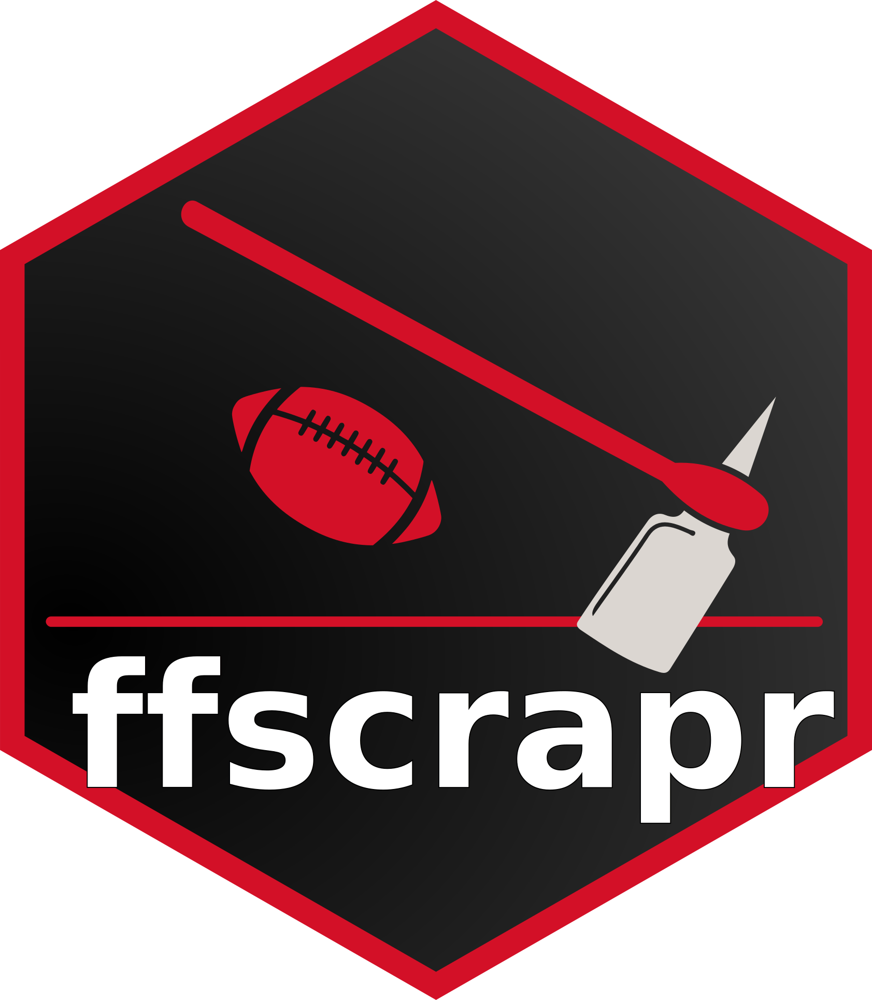

<!-- README.md is generated from README.Rmd. Please edit that file -->

```{r, include = FALSE}
knitr::opts_chunk$set(
  collapse = TRUE,
  comment = "#>",
  fig.path = "man/figures/README-",
  out.width = "100%"
)

options(tibble.print_min = 5, 
        pillar.bold = TRUE, 
        pillar.min_chars = 25, 
        pillar.min_title_chars = 25,
        dplyr.summarise.inform = FALSE,
        rmarkdown.html_vignette.check_title = FALSE)

eval <- TRUE

tryCatch(expr = {
  
  download.file("https://github.com/dynastyprocess/ffscrapr-tests/archive/main.zip","f.zip")
  unzip('f.zip', exdir = ".")
  
  httptest::.mockPaths(new = "ffscrapr-tests-main")},
  warning = function(e) eval <<- FALSE,
  error = function(e) eval <<- FALSE)

httptest::use_mock_api()
```

# ffscrapr <a href='#'></a>

*An R Client for Fantasy Football League APIs*

<!-- badges: start -->

[](https://CRAN.R-project.org/package=ffscrapr) 
[](https://ffscrapr.dynastyprocess.com/dev/) 
[](https://lifecycle.r-lib.org/articles/stages.html) 
[](https://codecov.io/gh/DynastyProcess/ffscrapr?branch=main) 
[](https://github.com/DynastyProcess/ffscrapr/actions) 
[](https://github.com/DynastyProcess/ffscrapr/actions) 
[](https://discord.com/invite/5Er2FBnnQa)

<!-- badges: end -->

Helps access various Fantasy Football APIs (currently MFL, Sleeper, Fleaflicker, and ESPN - eventually Yahoo, potentially others) by handling authentication/rate-limiting/caching, forming appropriate calls, and returning tidy dataframes which can be easily connected to other data sources.

### Installation

Version 1.4.2 is now on CRAN :tada: and can be installed with:

```{r eval = FALSE}
install.packages("ffscrapr")
# or from GitHub release with the remotes package via:
# install.packages("remotes")
remotes::install_github("dynastyprocess/ffscrapr", ref = "v1.4.2")
```

Install the development version from GitHub with:

```{r eval = FALSE}
remotes::install_github("dynastyprocess/ffscrapr", ref = "dev")
```

The dev version has a [separate documentation site here](https://ffscrapr.dynastyprocess.com/dev/).

### Usage

All `ffscrapr` functions start with a connection object created by `ff_connect()`, which stores connection, authentication, and other user-defined parameters. This object is used by all other functions to help return the correct data.

```{r eval = eval}
library(ffscrapr)
ssb <- ff_connect(platform = "mfl", league_id = "54040", season = 2020)

# Get a summary of league settings
ff_league(ssb) %>% str()

# Get rosters
ff_rosters(ssb)

# Get transactions
ff_transactions(ssb)
```

Platform-specific guides on getting started with ffscrapr are here:

-   [MyFantasyLeague](https://ffscrapr.dynastyprocess.com/articles/mfl_basics.html)  
-   [Sleeper](https://ffscrapr.dynastyprocess.com/articles/sleeper_basics.html)
-   [Fleaflicker](https://ffscrapr.dynastyprocess.com/articles/fleaflicker_basics.html)
-   [ESPN](https://ffscrapr.dynastyprocess.com/articles/espn_basics.html)

There are also some more advanced guides for custom API calls in the [Articles section](https://ffscrapr.dynastyprocess.com/articles/), as well as some guides on [optimizing ffscrapr's performance](https://ffscrapr.dynastyprocess.com/articles/ffscrapr_caching.html).

### Contributing

Many hands make light work! Here are some ways you can contribute to this project:

-   You can [open an issue](https://github.com/DynastyProcess/ffscrapr/issues/new/choose) if you'd like to request specific data or report a bug/error.

-   You can [sponsor this project with donations](https://github.com/sponsors/tanho63)!

-   If you'd like to contribute code, please check out [the contribution guidelines](https://ffscrapr.dynastyprocess.com/CONTRIBUTING.html).

### Terms of Use

The R code for this package is released as open source under the [MIT license](https://ffscrapr.dynastyprocess.com/LICENSE.html).

The APIs and data accessed by this package belong to their respective owners, and are governed by their terms of use.

```{r include = FALSE}
httptest::stop_mocking()
unlink(c("ffscrapr-tests-main","f.zip"), recursive = TRUE, force = TRUE)
```
