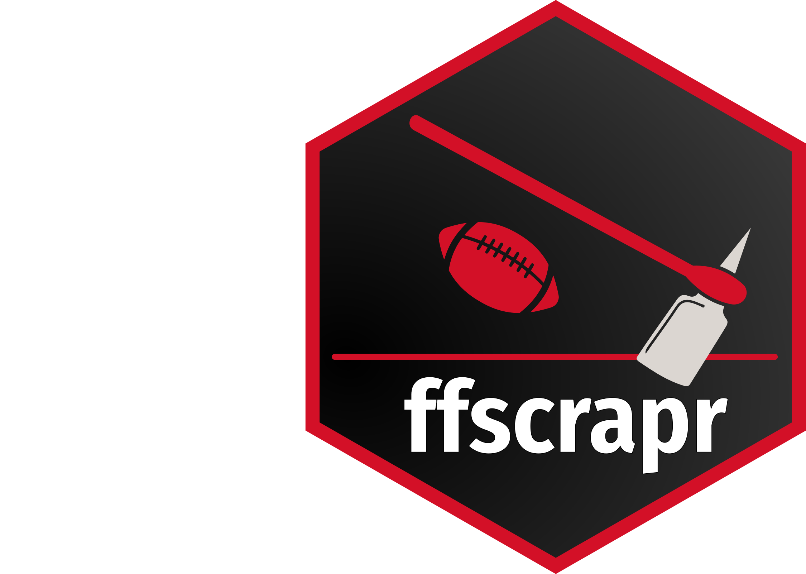

<!-- README.md is generated from README.Rmd. Please edit that file -->

# ffscrapr <a href='#'></a>

*An R Client for Fantasy Football League APIs*

<!-- badges: start -->

[](https://CRAN.R-project.org/package=ffscrapr)
[](https://www.tidyverse.org/lifecycle/#maturing)
[](https://codecov.io/gh/DynastyProcess/ffscrapr?branch=main)
[](https://github.com/DynastyProcess/ffscrapr/actions)

<!-- badges: end -->

Helps access various Fantasy Football APIs (i.e. MFL, Sleeper,
Fleaflicker, ESPN, Yahoo, potentially other platforms) by handling
authentication and rate-limiting, forming appropriate calls, and
returning tidy dataframes which can be easily connected to other data
sources.

### Installation

Version 1.1.0 is now on CRAN 🎉 and can be installed with:

``` r
install.packages("ffscrapr")
# or from GitHub release
# install.packages("remotes")
remotes::install_github("dynastyprocess/ffscrapr",ref = "v1.1.0")
```

Install the development version from GitHub with:

``` r
remotes::install_github("dynastyprocess/ffscrapr")
```

The dev version has a [separate documentation site
here](https://ffscrapr.dynastyprocess.com/dev/).

### Usage

All `ffscrapr` functions start with a connection object created by
`ff_connect()`, which stores connection, authentication, and other
user-defined parameters. This object is used by all other functions to
help return the correct data.

``` r
library(ffscrapr)
ssb <- ff_connect(platform = "mfl", league_id = "54040", season = 2020)

# Get a summary of league settings
ff_league(ssb) %>% str()
#> tibble [1 x 13] (S3: tbl_df/tbl/data.frame)
#>  $ league_id      : chr "54040"
#>  $ league_name    : chr "The Super Smash Bros Dynasty League"
#>  $ franchise_count: num 14
#>  $ qb_type        : chr "1QB"
#>  $ idp            : logi FALSE
#>  $ scoring_flags  : chr "0.5_ppr, TEPrem, PP1D"
#>  $ best_ball      : logi TRUE
#>  $ salary_cap     : logi FALSE
#>  $ player_copies  : num 1
#>  $ years_active   : chr "2018-2020"
#>  $ qb_count       : chr "1"
#>  $ roster_size    : num 28
#>  $ league_depth   : num 392

# Get rosters
ff_rosters(ssb)
#> # A tibble: 435 x 11
#>   franchise_id franchise_name player_id player_name pos   team    age
#>   <chr>        <chr>          <chr>     <chr>       <chr> <chr> <dbl>
#> 1 0001         Team Pikachu   13189     Engram, Ev~ TE    NYG    26.2
#> 2 0001         Team Pikachu   11680     Landry, Ja~ WR    CLE    28  
#> 3 0001         Team Pikachu   14085     Pollard, T~ RB    DAL    23.5
#> 4 0001         Team Pikachu   13645     Smith, Tre~ WR    NOS    24.9
#> 5 0001         Team Pikachu   12110     Brate, Cam~ TE    TBB    29.4
#> # ... with 430 more rows, and 4 more variables: roster_status <chr>,
#> #   drafted <chr>, draft_year <chr>, draft_round <chr>

# Get transactions
ff_transactions(ssb)
#> # A tibble: 843 x 12
#>   timestamp           type  type_desc franchise_id franchise_name player_id
#>   <dttm>              <chr> <chr>     <chr>        <chr>          <chr>    
#> 1 2020-11-15 17:54:18 IR    activated 0004         Team Ice Clim~ 14840    
#> 2 2020-11-15 17:54:08 FREE~ dropped   0004         Team Ice Clim~ 13316    
#> 3 2020-11-15 17:23:51 FREE~ added     0010         Team Yoshi     10708    
#> 4 2020-11-15 17:23:25 IR    deactiva~ 0010         Team Yoshi     14126    
#> 5 2020-11-15 16:45:09 TAXI  promoted  0013         Team Ness      14125    
#> # ... with 838 more rows, and 6 more variables: player_name <chr>, pos <chr>,
#> #   team <chr>, bbid_spent <dbl>, trade_partner <chr>, comments <chr>
```

For a more detailed usage example, including a template dynasty league
analysis script, please check out the reference articles and/or
vignettes\!

### Contributing

Many hands make light work\! Here are some ways you can contribute to
this project:

  - You can [open an
    issue](https://github.com/DynastyProcess/ffscrapr/issues/new/choose)
    if you’d like to request specific data or report a bug/error.

  - You can [sponsor this project with
    donations](https://github.com/sponsors/tanho63)\!

  - If you’d like to contribute code, please check out [the contribution
    guidelines](https://ffscrapr.dynastyprocess.com/CONTRIBUTING.html).

### Terms of Use

The R code for this package is released as open source under the [MIT
license](https://ffscrapr.dynastyprocess.com/LICENSE.html).

The APIs and data accessed by this package belong to their respective
owners, and are governed by their terms of use.
